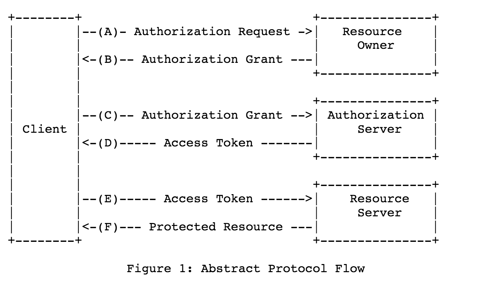

# OAuth 2
[RFC](https://tools.ietf.org/html/rfc6749#page-6)



## OAuth vs Xauth
Xauth是简单的OAuth，省掉了上图的ABCD，直接改成一步拿到access token（提供user,pass，服务器返回access token）。这种做法其实不被推荐,参考[Retirement of xauth](https://twittercommunity.com/t/retirement-of-xauth/88022)。

为什么，这个要从OAuth的定位说起
> The OAuth 2.0 authorization framework enables a third-party
   application to obtain limited access to an HTTP service, either on
   behalf of a resource owner by orchestrating an approval interaction
   between the resource owner and the HTTP service, or by allowing the
   third-party application to obtain access on its own behalf.

OAuth主要是做第三方认证（第三方即图中的Client）。
- 比如用户U在B公司有数据。A公司想要访问这些数据
- 比如我做一个网站，允许通过Facebook登陆。那么我就是Client，Facebook的用户就是自己在Facebook数据的Owner，Facebook承担Auth的职责。

那么我想要访问用户X在Facebook的数据的时候，怎样交互呢。理论模型就是
- 我问X，我想访问你在Facebook 的数据，可以吗。
- X说可以。
- 我找到Facebook，说，X同意我访问他在你这的数据了。以后我就找你要了啊。
	- Facebook问X，这是真的吗，
	- X说是的。
	- 我就可以访问X在Facebook的数据了。

那么这个模型这么形成一个协议呢。OAuth就是这样的协议。
- 用户在我的网站上，点击【使用Facebook 登陆】，我跳转到Facebook授权页面
	- 用户在Facebook登陆，点击授权
	- Facebook跳转到我的回调地址
	- 我拿到了auth grant
- 我向Facebook发起请求，提供给他auth grant
	- Facebook拿到auth grant，验证成功，下发给我一个access token
- 未来，我就可以拿access token去请求X在Facebook的数据了。

问题：
- 在这个过程中，我拿到用户的账号密码了吗？
没有，用户只会在Facebook上输入账号密码。我拿到的只是auth grant和access token。这也就是所谓的第三方授权
> The OAuth 2.0 authorization framework enables a third-party application to obtain limited access to an HTTP service...

- 为什么第一步，Facebook回调的时候，不能直接给我access token，而让我再请求一次，用auth grant 换access token。
	- 理论上，User和Auth Server是独立的。User只负责授权。不关心后续的流程。后续Client和Auth Server的交互使用什么方式都可以。Auth可以下发access token，或者随便别的。本质上，access token是作为Client和Auth的认证票据，甚至可以等于auth grant。User和Auth Server是两个系统，彼此独立。你进入了Auth的系统，未来要按照Auth的规则来。
	- 实际回调的时候，一般的都是http请求，如果直接返回access token，就等于暴露在网络中了。


OAuth协议的具体实现，以Twitter的实现为例：
[Twitter OAuth 2](https://developer.twitter.com/en/docs/basics/authentication/overview/3-legged-oauth)
- Client向Twitter 注册
	- Request
	```
	oauth_callback="https%3A%2F%2FyourWhitelistedCallbackUrl.com"
	oauth_consumer_key="cChZNFj6T5R0TigYB9yd1w"
	```
	- Response
	```
	oauth_token=NPcudxy0yU5T3tBzho7iCotZ3cnetKwcTIRlX0iwRl0
	oauth_token_secret=veNRnAWe6inFuo8o2u8SLLZLjolYDmDP7SzL0YfYI
	oauth_callback_confirmed=true
	```
	- 这一步主要是，向Twitter声明自己（之前已经注册好，所以有consumer\_key），并指定自己的callback。
	- Twitter返回token和token\_secret，用于未来请求的签名哈验证。
	- 注意这一步不严格属于OAuth。
- Client将用户重定向到Twitter，`https://api.twitter.com/oauth/authorize?oauth_token=NPcudxy0yU5T3tBzho7iCotZ3cnetKwcTIRlX0iwRl0`
	- 用户在Twitter完成授权，Twitter回调之前设置的回调地址
	- `https://yourWhitelistedCallbackUrl.com?oauth_token=NPcudxy0yU5T3tBzho7iCotZ3cnetKwcTIRlX0iwRl0&oauth_verifier=uw7NjWHT6OJ1MpJOXsHfNxoAhPKpgI8BlYDhxEjIBY`
	- 其中返回了oauth\_verifier（对应于协议中的auth grant），和oauth\_token
- Clint使用oauth\_verifier向Twitter换取access token
	- POST
	```
	POST /oauth/access_token
	oauth_consumer_key=cChZNFj6T5R0TigYB9yd1w
	oauth_token=NPcudxy0yU5T3tBzho7iCotZ3cnetKwcTIRlX0iwRl0
	oauth_verifier=uw7NjWHT6OJ1MpJOXsHfNxoAhPKpgI8BlYDhxEjIB
	```
	- Reponse
	```
	oauth_token=7588892-kagSNqWge8gB1WwE3plnFsJHAZVfxWD7Vb57p0b4
	oauth_token_secret=PbKfYqSryyeKDWz4ebtY3o5ogNLG11WJuZBc9fQrQo
	```
	- 这里`oauth_token`就是`access_token`，`secret`用于未来的签名校验
- Client可以使用`access_token`访问了。

### Xauth
那么Xauth能用于哪些场景呢，Xauth其实是简化了。会把user pass直接暴露给Client，所以只适合Client和Auth是同一个组织的情况。不涉及到第三方的问题。
