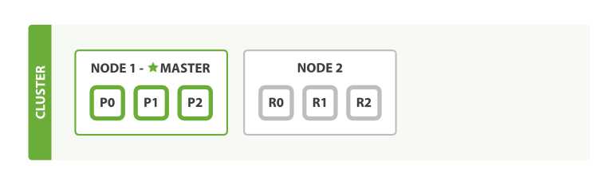

# Elasticsearch (ES)

## Intro
近实时的分布式搜索引擎。可以进行全文检索、结构化搜索、分析。良好的扩展性，可以运行在单台笔记本，也可以扩展到上百台服务器，轻松支持PB级数据。

## 优点
- 大数据量。PB级别数据，实时查询。新数据，近实时查询（1秒级别）
- 分布式，保证数据一致性、高可用
- 全文检索、相关性评分、同义词等

## Key Ingredient
- ES基于Lucene引擎，但是支持复杂的数据类型
- 使用倒排索引来支持全文检索
- 使用各种压缩算法来压缩存储，并进行多级索引，从而将搜索需要用到的数据结构加载进内存，主要操作内存化，减少磁盘IO，极大提升查询速率。
- 分布式存储，
	- 一个cluster，可以有多个node，进行水平扩展。一个node是一个启动的进程实例，可以是单机，也可以在多机部署。
	- 每个索引可以有多个primary shard和replica shard。保证数据安全和一致性。数据被哈希到某个primary shard，所有primary shard组成一份完整的数据结合。replica shard是primary shard的副本。primary shard number确定后不可更改，否则查询会miss。replica number可以随时调整。
	- 一个分片/shard其实就是一个Lucene实例，是单独的一个搜索引擎，管理自己的数据和索引。任意一条数据，都会存储到特定某一个分片，并在该分片上被索引。
	下面是例子，一个cluster，两个node，一个索引，配置了3个primary shard，`number_of_replicas=2`(每个primary shard有两个副本)
	
- ES定位在大数据量场景下的查询搜索，相对传统关系型数据库而言，查询有显然的优势。但数据变更速率相对较慢，不过这不是核心的关注点。

## Ref
[ES Official Getting Started](https://www.elastic.co/guide/cn/elasticsearch/guide/current/getting-started.html)
