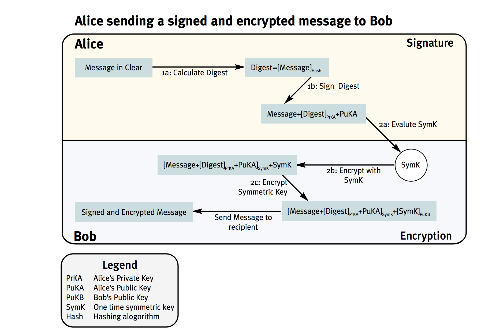
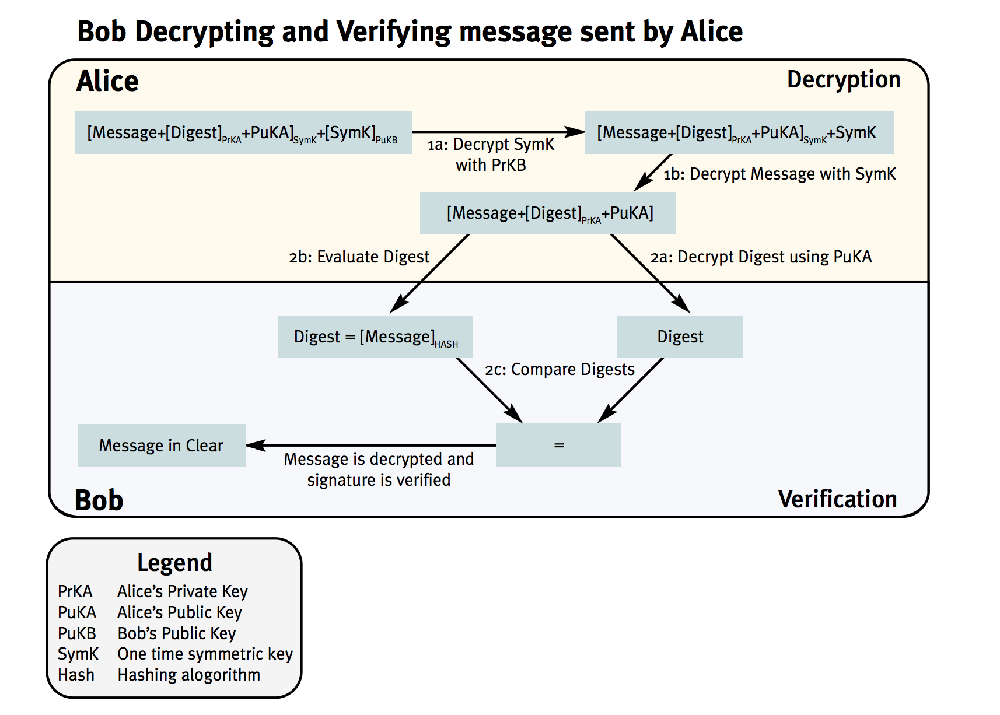
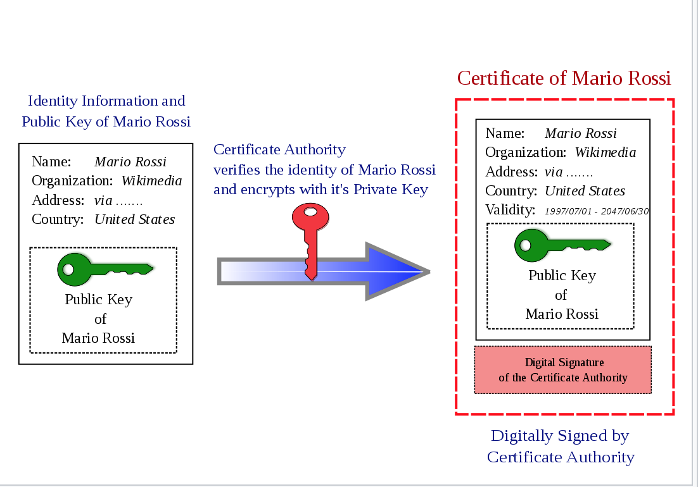
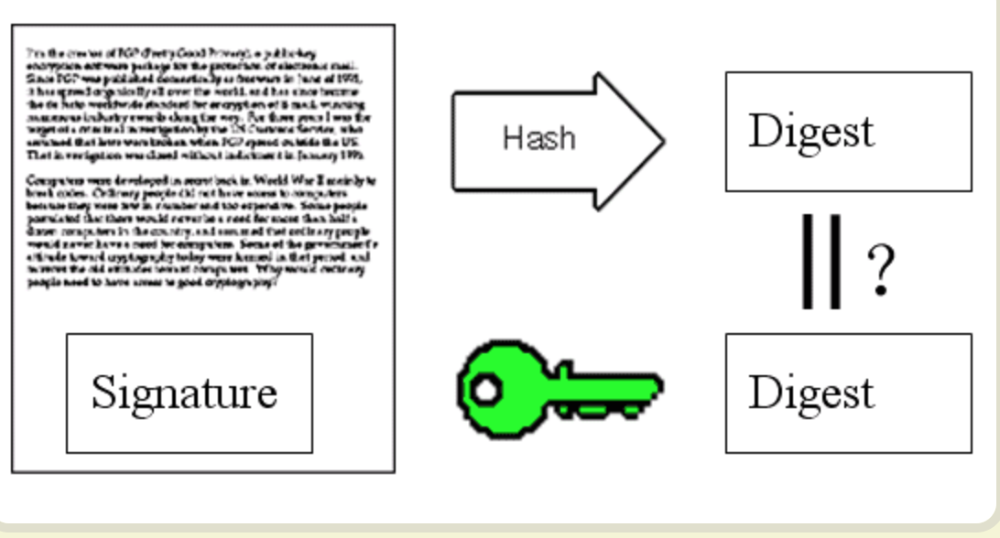
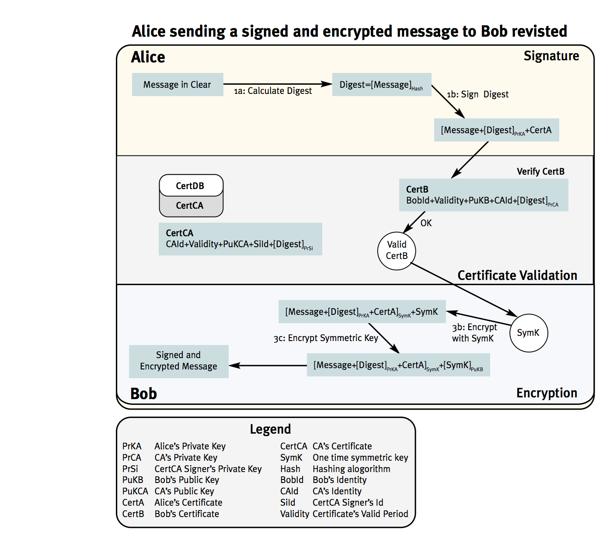

# Public key Infrastructure

## 加密解密
为了信息的安全传输，人们发明了加密，但加密需要可以解密，否则就失去了意义。

加密解密的唯一原则就是:
- 只有发送方和接收方知道信息的明文。

现有的加密解密方法有：
- 对称加密
- 非对称加密

## 对称加密
传统加密是对称加密，对称是说，双方只有一个密钥，共享。其面临的主要问题就是如何安全地传输这个密钥，因为双方都要事先知道。

## 公钥加密
后来出现了非对称加密。相对于对称加密必须要共享密钥。非对称加密由公钥私钥组成。公钥可以公开传播，由接收方使用。私钥由所有者保密。由于双方使用的密钥不同，故而相对于对称加密，被称为非对称加密。

公钥加密使用场景
- 消息加密
- 签名认证

### 公钥加密原理
简单讲，用私钥加密的内容，可以由公钥解密，反之依然。那么，假设A、B之间发送消息:
- A用自己的私钥和B的公钥加密了一条消息
- 只有拥有了A的公钥和B的私钥的人才能解密。理论上只有B自己才可以拥有自己的私钥（否则就是暴露了，那一切就完了。）。由于A的公钥是公开的，B可以获取到。那么，B也只有B可以解密。
- 如上，实现了双方的加密传输。
	- 而且是是在公网，不需要对网络环境做任何安全假设（而对称加密需要安全的网络来保证密钥的安全性，因为谁拥有了密钥，谁就可以解密）
	- 谁都可以获取到A的公钥，但只有B拥有自己的私钥。

### 公钥加密解密流程
[Ref](https://www.cgi.com/files/white-papers/cgi_whpr_35_pki_e.pdf)

#### 简单版本
说明，公钥可以公开传输，所以A,B提前都由对方的公钥。
- A用自己的私钥和B的公钥加密明文，生成密文，发送给B. EncMsg = PubB(PriA(PlainMsg))
- B用自己的私钥和A的公钥解密，拿到明文. DecMsg = PubA(PriB(EncMsg)) = PubA(PriB(PubB(PriA(PlainMsg)))) = PubA(PriA(PlainMsg)) = PlainMsg
- done

####  具体版本

## CA
通过上面，我们说公钥加密解决了加密解密的问题。那么有一个前提是：__谁能证明B就是B呢__

比如，A要向B（比如一个公司）发消息，A只知道B的名称叫做“BXXX Cop."，A需要B的公钥才能发消息，  
这时候有人(可以自称是B的人，也可以是任何人)发给A了一个公钥，说这是B的公钥，A怎么相信 _B就是B呢_，或者_所谓的B的公钥就是B的公钥呢_。

反过来也一样，B怎么能确定发送方就是A呢。

综合来说，在公钥体系内，公钥代表了一个人的身份，但当我说，这是我的公钥的时候，谁来证明呢？谁能证明谁是谁？

这个问题，就是由CA来解决。

### 基本模型
CA是一个大家都信任的第三方，当CA说A就是A，CA为他作证的时候，我们默认选择相信CA，也相信CA的证词。如此我们就相信A就是A。当所有参与方都默认相信一个CA的时候，参与方就可以互信。

那么这里边的风险在哪里呢，就在于CA怎么判断A就是A。

实际上，当有人需要CA为其作证的时候，比如公司“Axxx Cop'"，那么CA要A提供公司的营业执照，打电话咨询，向国家机构查询，百分之百确定A就是A的时候，CA才会为A作证（颁发证书）。

如上，CA是一个大家默认信任的机构，相当于大家都认可的审查者。CA说OK的时候，参与方就认为OK。当然CA的审查其实也是靠物理世界里的国家政府等资源来实现的。

整理来说，
- 参与方向CA申请认证，获得认证，证明自己是自己后，就可以参与通信。
- 通信双方在通信时，出示CA的证书，向对方证明自己是自己(互换公钥)。
- 通信双方开始用上面说的公钥加密开始通信
- done

### 具体实现
基本要素：
- 在公钥体系内，公钥代表一个人
- CA通过颁发证书，来证明A就是A。

#### 简单版本
- A向CA申请证明(CSR)，带上自己的公钥，个人ID，其他说明
- CA经过一番调查，验证了A就是A，生成一个证书
	- Signature = PrivCA(Digest(CSR))
	- Cert = CSR + Signature
- 证书签发done
- 当A、B通信的时候，B收到A发来的证书
	- B拿到证书内的CSR1和Signature1
	- B重做CSR的摘要，并和解密出来的摘要做对比。验证：
	- Digest(CSR1) = PubCA(Signature1) = PubCA(PrivCA(Digest(CSR))) = Digest(CSR)
		- 如果没有证书没有被篡改，那么上述验证成立。否则证书被篡改。
	- 当验证成功，B认为证书是合法的，那么证书内包含的公钥和证书上说明的个人ID是对应的。
		- 也就是说，CA证明，证书上ID是mmmm的人，它的公钥就是nnnn。
		- B看到证书上ID就是A（Axxx Corp)，那么也就像相信对应的公钥就是A的。
		- B可以用这个公钥和A通信了。

补充:
当B用CA的公钥解密出摘要，并验证成功后，证明了：
- 这个证书确实是该CA签发的
- 这个证书没有被篡改，因而内容有效
	- 证书是所说的个体所有
	- 证书提供的公钥是对应的个体所有

## 整合
- 公钥加密解决了在公网加密通信的问题。在公网，公钥代表一个人。
- CA的证书为个人ID和其公钥关联做背书，解决了身份认证问题(这是谁的公钥？)。

### 整合后的公钥加密通信
结合CA证书，调整后的公钥加密通信流程是：

